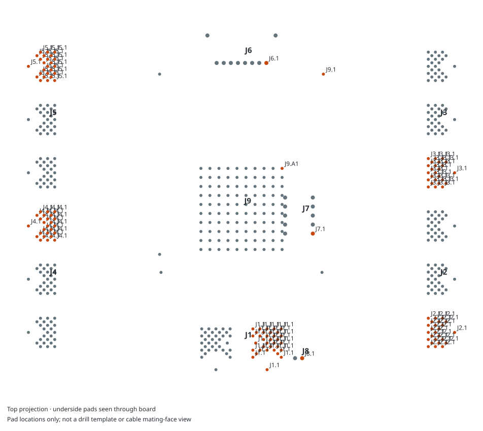

# Connection cheat sheet and orientation

QuadESC arrives with the SoM installed. Connect external power, motor leads, a flight controller and programming tools using the tables below. Disconnect power before attaching wires, and load your application before motor operation.

The drawing shows PCB pad centers from above. J9 is on the underside and appears through the board. For external cables, use the connector key and pad numbers: looking into a cable face can reverse the apparent order. The drawing locates connections; it does not include drilling or assembly tolerances.

## FC interface J6

| Pad | Net | How it is used |
|---|---|---|
| 1 | GND | Signal and power return |
| 2 | +BATT | Battery rail, not regulated logic power |
| 3 | FC_Current_IO | Current-reporting connection; match its scale to the application and FC input |
| 4 | FC_Telemetry | Telemetry connection; use the protocol implemented by the application |
| 5 | DSHOT1 | Channel 1 command input route |
| 6 | DSHOT2 | Channel 2 command input route |
| 7 | DSHOT3 | Channel 3 command input route |
| 8 | DSHOT4 | Channel 4 command input route |

Check the external controller's pinout and voltage levels before connecting J6, especially its battery pin. Command decoding, telemetry and current reporting are implemented by the application you load; select FC settings to match it.

## Connection decisions

| Need | Use | Check before connection |
|---|---|---|
| Battery entry | J1 | Polarity and [electrical targets](characterization.md) |
| Motor phases | J2–J5 | Phase names in the [pad table](connectors.md), channel order and wire strain relief |
| FC signals | J6 | Pin order, voltage levels and application protocol |
| Debug | J7 or SoM debug | Probe power direction and reset connection |
| Buzzer | J8 | Load and driver requirements for the connected buzzer |
| CAN | SoM connector | Bus wiring and supplies in the <a href="../som/interfaces.html">SoM interface guide</a> |

## Programming connections

For SWD at J7, use **pin 2 SWDIO, pin 4 SWCLK, pin 10 nRST**, and ground at **3, 5 or 9**. Pin 1 is the board's `+3.3V` rail; check the probe's supply/reference requirements before connecting it. The [full pad table](connectors.md#j7--debug) includes the other header signals.

ROM UART and BOOT are accessible on the installed **SoM J2**: TX 4, RX 6, ground 5, reset 7 and BOOT 8. Their J9 A3/C3/B1 positions are unconnected on the mainboard, so use the SoM connection. Follow the <a href="../som/boot.html">SoM BSL and recovery guide</a> for entry and transport settings.

## Shared controls

All four gate drivers share the two enable signals. Enabling or disabling those lines affects the whole board even when software is communicating with a single driver. Individual chip-select lines select SPI transactions; see [motor control](control.md) for the channel mapping.

The [complete pad table](connectors.md) also includes mechanical and unconnected pads, which helps when checking a footprint or assembling a harness.
