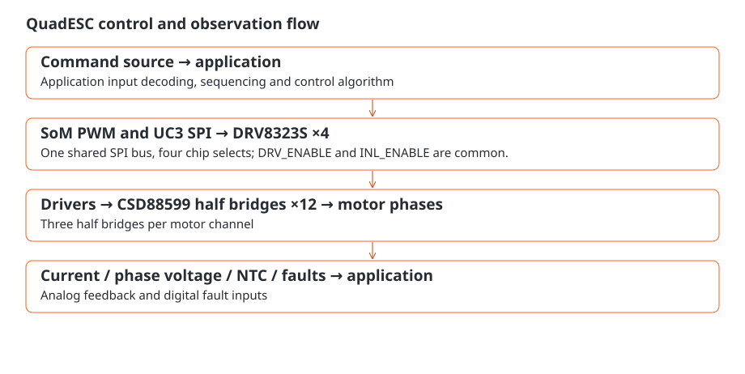

# QuadESC

QuadESC is an assembled four-channel motor-control board with its **AM13E SoM already installed**. It provides four three-phase power stages, current, voltage and temperature sensing, and regulated controller power. Factory ROM provides **TI BSL**. Load suitable motor-control firmware before operating connected motors.

Use the <a href="../som/index.html">standalone AM13E SoM manual</a> for module power selection, MCU interfaces, programming, boot and debug. This manual covers the power stages, shared controls, connections and software design for QuadESC. Start with the board overview to find your way around, or go straight to the connection guide when wiring the board.



## First use

1. Find battery J1, motor terminals J2–J5, FC header J6 and debug J7 in the [connection guide](connections.md). Leave motor loads disconnected while preparing the controller.
2. Connect a programming host through J7 SWD or the installed SoM's BSL interface. Follow [power](power.md) for supplies and the <a href="../som/boot.html">SoM boot guide</a> for BSL entry and loading.
3. Load your application and establish its startup, driver configuration and fault response. The [motor-control guide](control.md) gives the PWM routes, shared enables and feedback requirements.
4. With power disconnected, connect motor leads and the FC harness as needed. Match the FC protocol and reporting scale to your loaded application, then follow that application's controlled startup procedure within the [electrical limits](characterization.md).

## Explore the board

- [Board overview](overview.md): components and channel organization.
- [Connection cheat sheet](connections.md): integration interfaces and orientation.
- [Sensing deep dive](sensing.md): current sign, divider return and thermistor interpretation.
- [Specifications and compatibility](characterization.md): electrical targets and firmware limits.

```{toctree}
:maxdepth: 1
:caption: Board and connections

overview
connections
connectors
power
```
```{toctree}
:maxdepth: 1
:caption: Engineering deep dives

sensing
control
integration
dshot-pinmux
assembly
```
```{toctree}
:maxdepth: 1
:caption: Specifications and service

characterization
troubleshooting
maintenance
evidence
```
