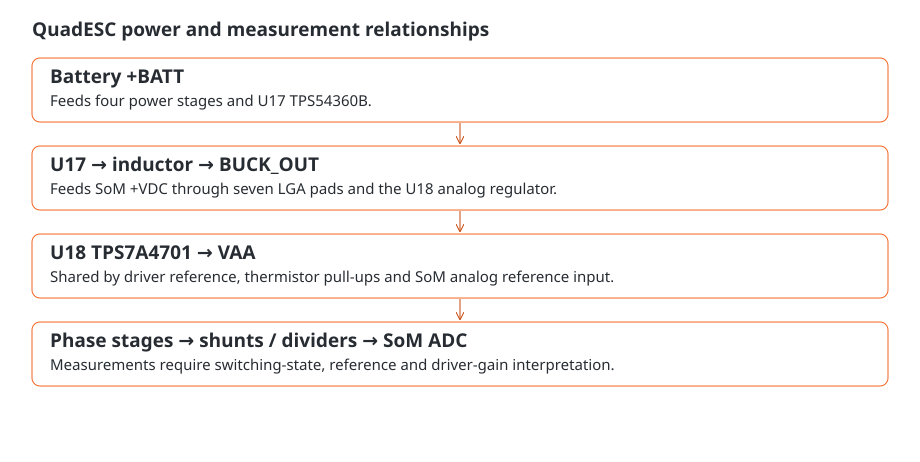

# Power entry, rails and limits

Battery power enters at J1 and feeds the four power stages. The mainboard also converts that supply into the lower-voltage rails used by the SoM and analog circuitry.



## From battery to controller

`+BATT` feeds the power stages and U17, the TPS54360B buck regulator. After the buck switching stage and inductor, `BUCK_OUT` supplies both the SoM's `+VDC` input and U18, the TPS7A4701 analog regulator. U18 produces `VAA` for the drivers and module analog reference.

## The module boundary

J9 pads **D5, D7, E4, E6, F7, G4 and G6** carry `BUCK_OUT` to the matching SoM `+VDC` pads. **J9 F5** carries VAA. Raw battery power must not be connected to the module's `+VDC` input.

Inside the module, a load switch, LDO and power mux provide digital power and the separate debug-supply path. See the <a href="../som/power.html">SoM power guide</a> when using debug power alongside the mainboard supply.

## Electrical limits

The intended battery range is **3S–6S, 9–25.2 V**. The [specifications page](characterization.md) explains the design voltage and current targets and their thermal limits. Check polarity at J1 before powering the board, and account for battery voltage on FC connector J6.2 as well.

Power-entry wiring and components need margin for switching overshoot and transients, including suitable bulk-capacitor voltage margin and return-current paths. Check the logic rails and reference with motor loads disconnected before moving to load operation.

## Why current and temperature interact

Shunt and conduction heating rise approximately with the square of current:

```text
Pshunt = I² × Rshunt
```

For a nominal **1 mΩ** shunt, a continuous **40 A** through that shunt produces **1.6 W**; **70 A** produces **4.9 W**. PWM conduction intervals, board copper, airflow and pulse duration change the resulting temperature. The current in a low-side shunt also depends on switching state, as explained in [sensing](sensing.md).

The analog reference affects reported current and voltage. If a reading changes unexpectedly with load, check VAA as well as the signal: a shifting reference can change the ADC code even when the measured quantity stays the same.
