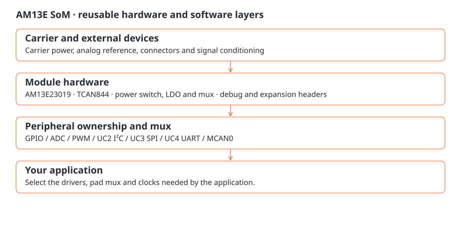

# AM13E SoM

Welcome to the AM13E SoM manual. This small controller module brings together an AM13E23019 microcontroller, CAN transceiver, power selection and accessible debug and expansion connections. Use it for sensing, timed outputs, communications or control on a carrier of your own. The module is reusable and can operate independently of QuadESC.

The module ships with **TI ROM BSL only**. Start with power and programming access, then load the application for your project. If you are designing a carrier, the interface and pad references help you connect the peripherals your project needs.



## Find an answer

- **First connection:** [Getting started](getting-started.md) and [power](power.md).
- **Pin or peripheral:** [Interface cheat sheet](interfaces.md) and [complete connector reference](connectors.md).
- **Software:** [Programming an application](firmware.md), [debugging and peripheral checks](diagnostics.md) and [boot/recovery](boot.md).
- **New carrier:** [Carrier integration](carrier.md), [analog inputs](analog.md) and [timed outputs](timing.md).

```{toctree}
:maxdepth: 1
:caption: Start here

getting-started
identity
power
```
```{toctree}
:maxdepth: 1
:caption: Connections and deep dives

interfaces
connectors
analog
timing
carrier
```
```{toctree}
:maxdepth: 1
:caption: Development and service

firmware
diagnostics
boot
troubleshooting
maintenance
evidence
```
