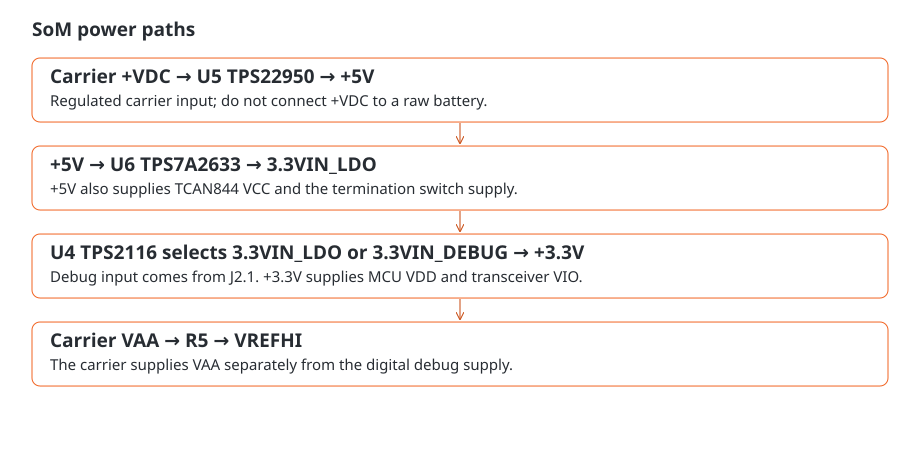

# Power and analog reference

The SoM has two digital power paths: regulated carrier power through the underside array, and a separate 3.3 V debug input. An onboard mux selects between them. Analog measurements use the separate VAA connection.

## Digital paths

Carrier power enters on `+VDC` and reaches VIN and ON of U5, a TPS22950 load switch. Its output is the module's `+5V` rail. U6, a TPS7A2633 regulator, takes that rail at IN and EN and produces `3.3VIN_LDO`.

U4, a TPS2116 power mux, receives `3.3VIN_LDO` on input 1 and the J2.1 debug supply, `3.3VIN_DEBUG`, on input 2. Its output is `+3.3V`, which powers MCU VDD and the TCAN844 VIO connection.

**Use regulated carrier power at `+VDC`.** U5 switches the supply; it does not reduce its voltage. Raw battery power must not be connected here.

| Connection | Net/path | How to use it |
|---|---|---|
| J1 D5, D7, E4, E6, F7, G4, G6 | `+VDC` to U5 | Regulated carrier supply input |
| J2.1 | `3.3VIN_DEBUG` to mux input 2 | Digital power input; check the debugger's power direction |
| J5.1; J3.11; J6.4 | `+5V` | Shared supply rail, also needed by the CAN transceiver |
| J6.11; J4.2 | `+3.3V` | Digital rail shared with onboard loads |
| J1 F5; J3.4 | `VAA` | Separate analog reference input |

## Reference and sequencing

VAA reaches `VREFHI` through R5. ADC results scale with this reference: a change in reference voltage changes the voltage represented by each count. See [analog acquisition](analog.md) for conversions and sampling.

Debug-only power is useful for communicating with the MCU. To read analog inputs, also supply VAA; to communicate over CAN, supply the transceiver's 5 V rail.

When connecting external devices, avoid driving signals above an unpowered receiver's supply rail. Check how the carrier, debug supply and connected accessories behave when one is powered and another is off, including possible reverse-current paths.

## Supply limits

The connector rails share their capacity with the module's own circuitry. Available accessory current depends on the input supply, regulator voltage drop and temperature. Include those loads when sizing the carrier supply, and check rail voltage and heating with accessories connected. Component limits alone do not establish the assembled module's load-current rating.
